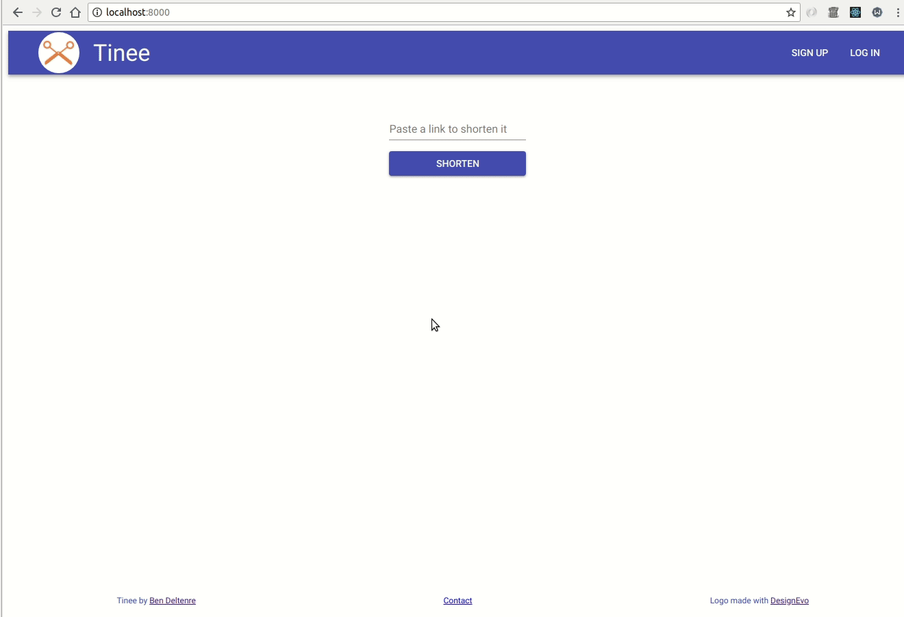
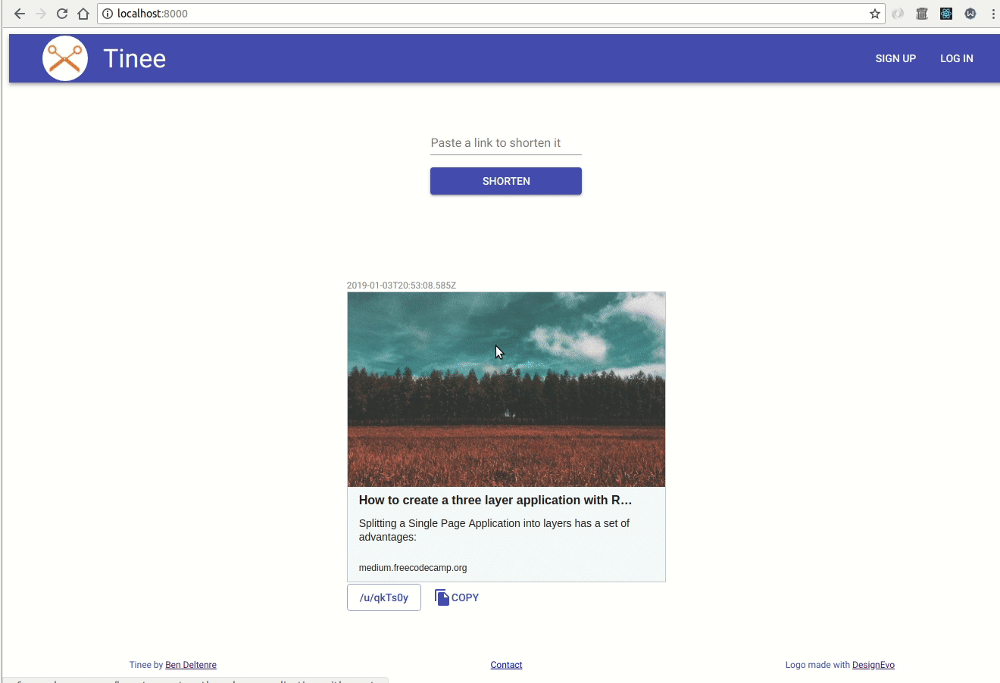
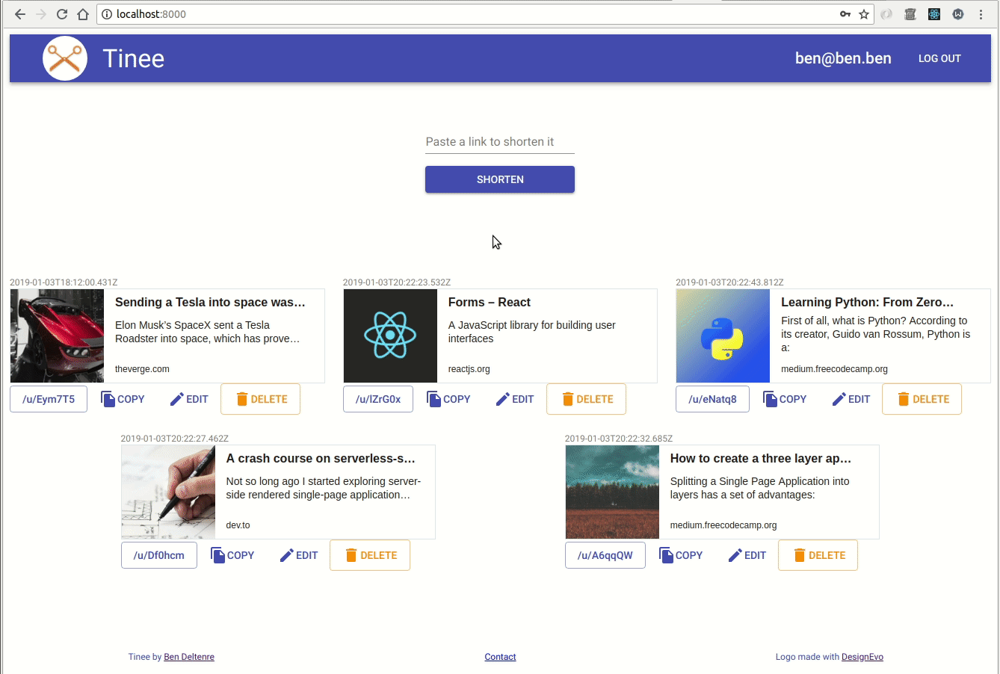
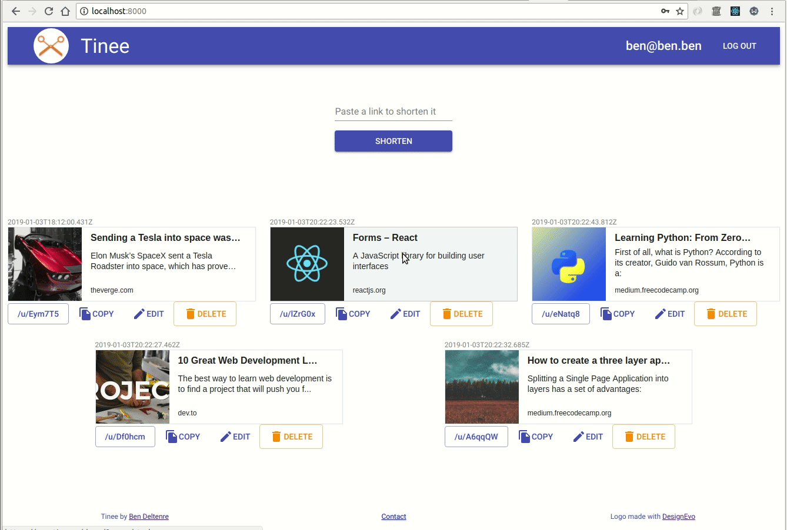

# Tinee

URL shortener built with **Mongo**, **Express**, **React** and **Node**. The basic functionality of shortening links and copying them is available to unauthenticated users. Logged-in users have their shortened links automatically saved. Then they can copy, edit or delete them. Although all the core functionalities are complete. I will keep working on that project to add new features such as a search bar and seeds for the Database.

## Screenshots



*Shorten a URL as an unauthenticated user*



*Sign into an existing account and retrieve previously saved links*



*Edit a specific URL*



*Delete a specific URL*

## Getting Started

* Clone this repository on your local machine and cd into it

* Install the dependencies
```
npm install
```
* Launch the server and the front-end app
```
npm start
```
On your browser, go to ```http://localhost:8000```